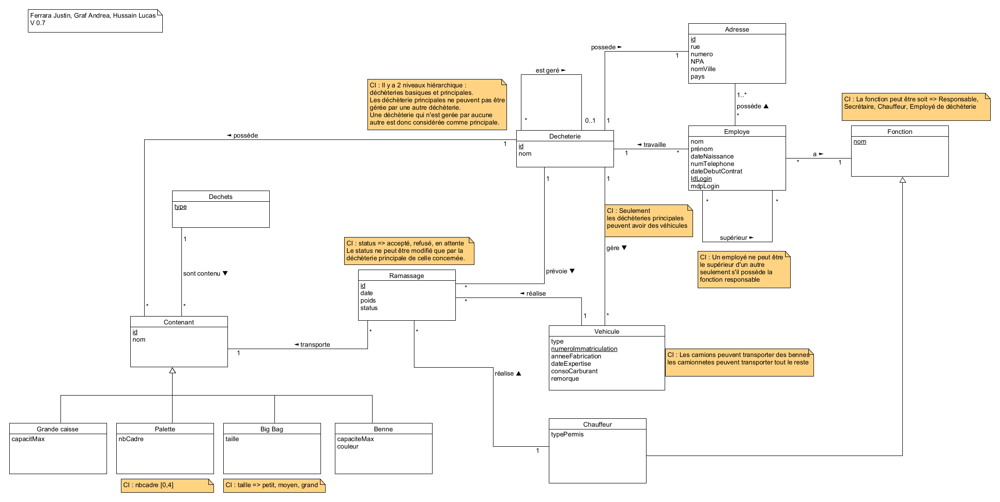
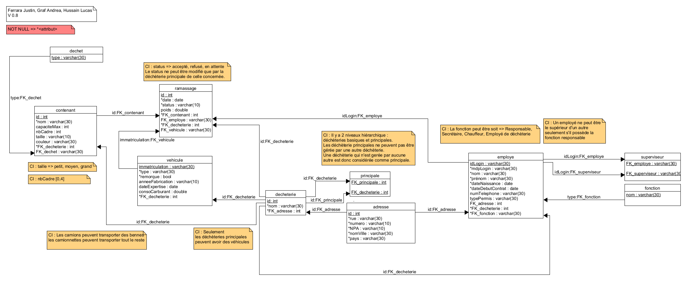

# DAI-lab-http-infrastructure

### Authors: Justin Ferrara, Andrea Graf

## Step 1: Static Web site

To start, we created a static Web page with its own folder.
We created a folder named `website` that contains everything's needed for the website. To modify the website, we can
modify the files in this folder.

To test the website, we can simply download an website example online and put it inside the `website` folder. To test,
we
downloaded a website from [here](https://startbootstrap.com/themes) and put it in the `website`
folder.

### Dockerfile

To correctly configure the docker image of our nginx server, we need to add this docker file in the root folder of the
nginx folder.

Dockerfile:

```
FROM nginx
RUN rm /etc/nginx/conf.d/default.conf
COPY website /usr/share/nginx/html
COPY nginx.conf /etc/nginx/conf.d/
```

This file contains the instructions to build the docker image. It starts from the `nginx` image and copies the `website`
folder in the `/usr/share/nginx/html` folder of the image. It also copies the `nginx.conf` file in
the `/etc/nginx/conf.d` folder of the image.

To avoid conflict while building the image, we remove de default configuration file of nginx in the `/etc/nginx/conf.d`
folder.

To build the docker image alone, we can use the following command inside the folder of the docker file:

```bash
docker build -t dai/nginx-test .
```

To run the docker image, we can use the following command:

```bash
docker run -d -p 80:80 dai/nginx-test
```

It will start the docker image in detached mode and map the port 80 of the container to the port 80 of the host. We
should
now be able to access the website with the url `localhost`.

### nginx.conf

This file contains the configuration of the nginx server. It is a simple configuration that serves the files in the
`/usr/share/nginx/html` folder. The server will start on port 80 and display the files in the `website` folder. The
first page will be `login.html`. We always start the server on port 80 because we are not using HTTPS for the moment and
afterward, we will use a reverse proxy to andle HTTPS connection and communicate with the nginx directly on port 80.

The nginx.conf:

```
server {
    listen 80;
    server_name localhost;
    location / {
        root /usr/share/nginx/html;
        index login.html;
    }
}
```

Feel free to modify the default page by modifying the `index` parameter with your default page.

## Step 2: Docker compose

#### Note: after this point, we will use the Garbage Center Management System as our API and website.

### Docker compose file for step 2

This is the docker compose file we used for step 2. It contains only the nginx service.

```yaml
version: '3.8'
services:
  nginx:
    build: nginx
    ports:
      - "8080:80"  # To map the port 80 of the container to the port 8080 of the host
```

In this docker compose file, we are using the nginx service. We are building the docker image with the docker file in
the nginx folder. We are also mapping the port 80 of the container to the port 8080 of the host.

### Docker compose file

This is our final docker compose file, containing all the services we used for this project.

```yaml
version: '3.8'
networks:
  bdr-net:
    driver: bridge

services:
  postgresql:
    image: 'bitnami/postgresql:16'
    container_name: bdr-postgresql-dai-https
    environment:
      - POSTGRESQL_USERNAME=bdr
      - POSTGRESQL_PASSWORD=bdr
      - POSTGRESQL_DATABASE=bdr
      - POSTGRESQL_POSTGRES_PASSWORD=root
    ports:
      - 5432:5432
    volumes:
      - .:/data:ro
    networks:
      - bdr-net

  reverseproxy:
    image: traefik
    command:
      - --providers.docker
    volumes:
      - /var/run/docker.sock:/var/run/docker.sock
      - ./traefik/ssl:/etc/traefik/certificates
      - ./traefik/traefik.yaml:/etc/traefik/traefik.yaml
    ports:
      - "80:80" # Web sites
      - "443:443" # Web sites
      - "8080:8080" # Traefik dashboard

  javaserver:
    image: dai-lab-https-java-server-1
    expose:
      - 80
    build:
      context: .
    labels:
      - traefik.http.routers.javaserver.rule=Host(`localhost`) && PathPrefix(`/api`)
      - traefik.http.services.javaserver.loadbalancer.sticky=true
      - traefik.http.services.javaserver.loadbalancer.sticky.cookie.name=StickyCookie
      - traefik.http.services.javaserver.loadbalancer.sticky.cookie.secure=true
      - traefik.http.routers.javaserver.entrypoints=https
      - traefik.http.routers.javaserver.tls=true

    deploy:
      replicas: 2

  portainer:
    image: portainer/portainer-ce:latest
    ports:
      - 9443:9443
      - 9000:9000
    volumes:
      - /var/run/docker.sock:/var/run/docker.sock
      - ./portainer_data:/data
    restart: unless-stopped #restart automatically if not stopped by user

  nginx:
    build: nginx
    labels:
      - traefik.http.routers.nginx.rule=Host(`localhost`)
      - traefik.http.routers.nginx.entrypoints=https
      - traefik.http.routers.nginx.tls=true
    deploy:
      replicas: 2
```

### Docker compose file explanation

To start the docker compose, we can use the following command:

```bash
docker compose up
docker compose up -d # To start the docker compose in detached mode
```

To rebuild the docker compose, we can use the following command:

```bash
docker compose build
docker compose up --build # To rebuild the docker compose and start it
```

To stop the docker compose, we can use CTRL-C if docker compose is not in the background or the following command:

```bash
docker compose stop
docker compose down # To stop and remove the docker compose
```

## Step 3: HTTP API server

### Overview

We jointly integrated the database project with the DAI project for the graphical interface part to display the data.
The database project is a garbage center management system. It allows to manage the employees and the waste collection
schedule.

In our graphical interface, we have two views. Each view is displayed in function of the role of the login user. We
have
three roles: Employe, Secrétaire and Responsable. The role is defined in the database project. The login is also defined
in the database project. Every user have the same password: `password`.
Here is a small list of some of the users:

| Login    | Password | Last name | First name | Role        |
|----------|----------|-----------|------------|-------------|
| jdoe     | password | Doe       | John       | Responsable |
| lhussain | password | Hussain   | Lucas      | Secrétaire  |
| asmith   | password | Smith     | Alice      | Employé     |

The first one is the employes view. It allows to see the list of the employees and to add, modify or delete an employee.

The second one is the waste collection view. It allows to see the waste collection and to add, modify or delete a waste
collection.

To make the project more realistic, we added a database to store the data. We used the PostgreSQL database.

### Data Base
#### Entity-Relationship Diagram
Here is the Entity-Relationship Diagram of the database:


#### Relational Schema
Here is the Relational Schema of the database:



All the schemas, diagrams and SQL scripts were created during the database project.
### API

To communicate with the api, we used the url `localhost/api`. We tested each CRUD operation with the software Bruno and
save the tests inside the `Bruno` folder.

| HTTP Method | URL                            | Description                               |
|-------------|--------------------------------|-------------------------------------------|
| GET         | /api/employes                  | Retrieve all employees*                   |
| GET         | /api/employes/{idlogin}        | Retrieve a specific employee              |
| POST        | /api/employes                  | Create an employee                        |
| PUT         | /api/employes/{idlogin}        | Modify a specific employee                |
| DELETE      | /api/employes/{idlogin}        | Delete a specific employee                |
| GET         | /api/employesExist/{idlogin}   | Check if a specific employee exists       |
| GET         | /api/fonctions                 | Retrieve employees' functions             |
| GET         | /api/adresses                  | Retrieve employees' addresses             |
| GET         | /api/decheteries               | Retrieve landfills                        |
| GET         | /api/vehicules                 | Retrieve vehicles                         |
| GET         | /api/contenants/{idDecheterie} | Retrieve employees in a specific landfill |
| GET         | /api/employesList              | Retrieve the list of drivers              |
| GET         | /api/ramassages                | Retrieve pickups                          |
| GET         | /api/ramassages/{id}           | Retrieve a specific pickup                |
| POST        | /api/ramassages                | Create a pickup                           |
| DELETE      | /api/ramassages/{id}           | Delete a pickup                           |
| PUT         | /api/ramassages/{id}           | Modify a pickup                           |

*Note that, for these functions, data retrieval may vary based on cookies.

For each of the CRUD operations, we used the json format to send the data to the API. We also used the json format to
retrieve the data from the API.

To match the database, we created several classes to represent the data. We also created some classes to represent the
different views of the database.

### Dockerfile

This is the docker file we used to build the docker image of the java server. We are using the maven image to build the
.jar file and the amazoncorretto image to run the .jar file.

To be able to let the dockerfile compiling and executing the image, we need to provide the source code and the pom file.
To do so, we need to copy the source code inside the docker image and the pom file. We also need to specify the working
directory of the docker image. In our case, we are using the `/app` folder as the working directory. We also need to
specify the command to execute when the docker image is started. In our case, we ar using the
commannd `mvn clean package`
to build the .jar file and the command `java -jar target/dai-lab-https-1.0-SNAPSHOT-jar-with-dependencies.jar` to
execute the .jar file.

```dockerfile
FROM maven:3.9.4-amazoncorretto-21
WORKDIR /app
COPY src/ /app/src/
COPY pom.xml /app/
RUN mvn clean package
CMD ["java", "-jar", "target/dai-lab-https-1.0-SNAPSHOT-jar-with-dependencies.jar"]
```

## Step 4: Reverse proxy with Traefik

To start, we have to add the Traefik service in the docker compose file. We also have to add the labels to the services
we want to be accessible from the outside. In our case, we want to access the nginx server and the javaserver. We also
want to access the Traefik dashboard.

```yaml
  reverseproxy:
    image: traefik
    command:
      - --api.insecure=true # Enable Traefik dashboard
      - --providers.docker
    volumes:
      - /var/run/docker.sock:/var/run/docker.sock
    ports:
      - "80:80" # Web sites
      - "8080:8080" # Traefik dashboard
```

The first line is the name of the service. The second line is the image we want to use. The third line is the command
we want to execute when the container is started.

In our case, we want to enable the Traefik dashboard, and we want to
use the docker provider. The docker provider allows Traefik to discover the services running in the docker compose file.
The fourth line is the volume we want to mount to allow Traefik to access the docker socket. The fifth line is the ports
we want to expose. In our case, we want to expose the port 80 for the websites and the port 8080 for the Traefik
dashboard.

In this specific case, /var/run/docker.sock:/var/run/docker.sock allows Traefik to access the Docker socket of the host
system from the container. The Docker socket (docker.sock) is an access point to the Docker API that allows Traefik to
interact dynamically with the Docker engine to retrieve information about running containers, networks, etc.

By using this volume, Traefik can monitor the status of Docker containers, discover newly created or deleted services,
and dynamically update its configuration based on changes in the Docker environment, allowing it to redirect traffic to
the appropriate services dynamically and automatically.

```
nginx:
    build: nginx
    labels:
        - traefik.http.routers.nginx.rule=Host(`localhost`)
        
javaserver:
    image: dai-lab-https-java-server-1
    expose:
      - 80
    build:
      context: .
    labels:
      - traefik.http.routers.javaserver.rule=Host(`localhost`) && PathPrefix(`/api`)
```

In our case, we want to access the nginx server and the javaserver. We also want to access the traefik dashboard. To do
so, we must add the labels to the services we want to be accessible from the outside. For the nginx server, we want
to access it with the url `localhost`. So we add the label `traefik.http.routers.nginx.rule=Host(`localhost`)`.

For the javaserver, we want to access it with the url `localhost/api`. So we add the label
`traefik.http.routers.javaserver.rule=Host(`localhost`) && PathPrefix(`/api`)`. To be able to access the javaserver, we
also have to expose the port 80.

### Pros of a reverse proxy

By using a reverse proxy, we can access all the services running inside the docker compose file with only one url. We
don't have to specify the port of each service.

We can also use the reverse proxy to handle the HTTPS connection and communicate with the nginx directly on port 80.
It allows us to have a secure connection between the client and the server without having to modify the code of the
services, or putting it inside a DMZ.

For security reasons, only the reverse proxy is accessible from the outside.

We can also use the reverse proxy to handle the load balancing and scalability of the services running inside the docker
compose file. We can also use the reverse proxy to handle the sticky sessions.

## Step 5: Scalability and load balancing

To let Traefik discover how many instances of a service are running, we have to add the following label to the service:

```yaml
    command:
      - --providers.docker
    volumes:
      - /var/run/docker.sock:/var/run/docker.sock
```

By doing this, we are saying to Traefik to use the docker provider to discover the services running inside the docker
and to use the docker socket to access the docker engine. With this configuration, the socket will be mounted (and not
copied) inside the container and make possible the dynamic discovery of the services running inside the docker compose
file.

To start several server instance, we use the `deploy` command inside the docker compose file

```yaml
  nginx:
    build: nginx
    labels:
      - traefik.http.routers.nginx.rule=Host(`localhost`)
    deploy:
      replicas: 2
```

For testing Treafik, we can use this command to add or remove some instance of each service running inside the docker
compose:

```
docker compose up --scale nginx=6 -d
```

This command will set the number of instances for nginx to 6. If the actual number of instances is lower, docker will
add new instances. And if it's greater, it will remove instances.

To check if its truly working, we can use the Traefik dashboard. We can access it with the url `localhost:8080` and
check the number of instance for each service that Traefik is managing. We should see the number of instance that we set
earlier.

## Step 6: Load balancing with round-robin and sticky sessions

To enable sticky-sessions, we just have to put these lines inside the configuration of the javaserver inside the docker
file :

```
    labels:
      - traefik.http.services.javaserver.loadbalancer.sticky=true
      - traefik.http.services.javaserver.loadbalancer.sticky.cookie.name=StickyCookie
```

We don't have to specify a sticky cookie for the nginx server because our web page is stateless. So, we don't need to
keep the session of the user on the same server.

To test the sticky sessions, we added logs inside the java server. We can see the logs inside the command line and check
with the docker header which instance of the java server is responding.

| Server instance | Sticky cookie   | Round robin             |
|-----------------|-----------------|-------------------------|
| java server     | Test Ok         | Ok, if no Sticky cookie |
| nginx           | not implemented | Test Ok                 |

## Step 7: Securing Traefik with HTTPS

To secure Traefik with HTTPS, we must modify the docker compose file to mount the new configuration file and map the
new volume for the certificates. We also need to add the 443 port to be able to make an HTTPS connection.

```
  reverse_proxy:
    image: traefik
    command:
    - --providers.docker
    volumes:
      - /var/run/docker.sock:/var/run/docker.sock
      - ./traefik/ssl:/etc/traefik/certificates
      - ./traefik/traefik.yaml:/etc/traefik/traefik.yaml
    ports:
      - "80:80" # Web sites
      - "443:443" # Web sites
      - "8080:8080" # Traefik dashboard
```

To enable the HTTPS connection, we have to modify the other services running in the docker compose file. We have to add
the labels to enable the HTTPS connection and to specify the entrypoint to use. We can also specify now to use the
sticky cookie only for the HTTPS connection for a better security.

```
labels:
    - traefik.http.routers.javaserver.entrypoints=https
    - traefik.http.routers.javaserver.tls=true
    - traefik.http.services.javaserver.loadbalancer.sticky.cookie.secure=true
```

Inside the configuration file of Traefik, we have to specify the certificates to use and the entrypoints to use. We also
have to specify the port to use for the HTTPS connection and the port to redirect the HTTP connection to an HTTPS
connection.

```
# Define providers
providers:
  docker:
    endpoint: "unix:///var/run/docker.sock"
    exposedByDefault: true


# Define entrypoints
entryPoints:
  http:
    address: ":80"
    http:
      redirections:
        entryPoint:
          to: https
          scheme: https
          permanent: true
  https:
    address: ":443"

# Configure the API
api:
  insecure: true
  dashboard: true

tls:
  certificates:
    - certFile: "/etc/traefik/certificates/cert.pem"
      keyFile: "/etc/traefik/certificates/key.pem"
```

To generate the certificates, we can use the following command inside a linux terminal:

```
openssl req -x509 -newkey rsa:4096 -keyout key.pem -out cert.pem -sha256 -days 365
```

It will generate the certificates and the key of a validity of one year. We must put them inside the
folder `traefik/ssl`.

## Optional steps

### Optional step 1: Management UI

To manage easily the docker containers, we can use the portainer service. To do so, we have to add the following service
inside the docker compose file:

```yaml
  portainer:
    image: portainer/portainer-ce:latest
    ports:
      - 9443:9443
      - 9000:9000
    volumes:
      - /var/run/docker.sock:/var/run/docker.sock
      - portainer_data:/data
    restart: unless-stopped
```

We are mapping the port 9443 for the HTTPS connection and the port 9000 for the HTTP connection. We are also mapping the
docker socket to allow portainer to manage the docker containers. We are also mapping a volume to allow portainer to
save the data.

With this configuration, we can access the portainer dashboard with the url `localhost:9000` or `localhost:9443`. With
portainer, we can manage the docker containers, the docker images, the docker volumes and the docker networks easily,
without coding manually a web interface.

#### Portainer labels --Tested but not used

In the beginning, we tried to use the reverse proxy Traefik to access the Portainer dashboard and manage the HTTPS
connection. However, we encountered some issues with the Traefik dashboard and the Portainer dashboard. We were able to
access the Traefik dashboard, but not the Portainer dashboard. We tried to resolve this issue with the Professor, but
we were not able to find a solution. We decided to use the previous configuration to access the Portainer dashboard.

```yaml
    portainer:
      image: portainer/portainer-ce:latest
      ports:
        - 9443:9443
        - 9000:9000
      volumes:
        - /var/run/docker.sock:/var/run/docker.sock
        - ./portainer_data:/data
      restart: unless-stopped #restart automatically if not stopped by user
    labels:
      - traefik.http.routers.portainer.rule=Host(`localhost`) && PathPrefix(`/portainer`)
      - traefik.http.routers.portainer.entrypoints=https
      - traefik.http.routers.portainer.tls=true
      - traefik.http.services.portainer.loadbalancer.server.port=9000
```

### Optional step 2: Integration API - static Web site

As we said earlier, we integrated the database project with the DAI project for the graphical interface part to display
the data. It includes some javascript code to display the data and make all the CRUD operations.

In the `Management.js` file, several functions are defined to handle interactions with the API and update the user
interface.

1. `fetchDataEmployee()` and `fetchDataRamassage()`: These functions respectively retrieve employee and pickup data from
   the API and call the populateTable() function to fill the table with the retrieved data.

2. `populateTable(data, type)`: This function populates the HTML table with the provided JSON data. It dynamically
   creates table headers and rows based on the data.

3. `deleteElementById(id, type)`: This function sends a DELETE request to the API to remove an element by its ID.

4. `fetchFonctions()`, `fetchAdresses()`, `fetchDecheteries()`, `fetchEmployesList()`, `fetchVehicle()`, `fetchStatus()`:
   These functions retrieve respective data from the API and call the populateDropdown() function to fill dropdown lists
   with the retrieved data.

5. `populateDropdown(dropdownId, data)`: This function fills an HTML dropdown list with the provided JSON data.

6. `submitUpdateEmployeeForm()`, `submitRamassageUpdateForm()`, `submitCreateEmployeeForm()`, `submitCreateRamassageForm()`:
   These functions retrieve form values, create an object with these values, convert it to JSON, and send a PUT or POST
   request to the API to update or create an employee or pickup.

7. `onClickAnnulerEmployee()`, `onClickAnnulerRamassage()`, `onClickAddEmployee()`, `onClickAddRamassage()`: These
   functions redirect the user to another page when a button is clicked.

8. `logout()`: This function removes all cookies and redirects the user to the login page.

These functions manage interactions between the user interface and the API, providing a dynamic interface for viewing,
creating, modifying, and deleting data.

In the HTML files `employesUpdate.html` and `ramassagesUpdate.html`, JavaScript code is included at the end to populate
the forms when clicking the "Modify" button for an object. This JavaScript code retrieves information from the selected
object and places it in the appropriate form fields. Here's how it works:
`window.onload`: This function is executed when the page is fully loaded. It retrieves the ID of the object to be
modified from the page URL (e.g., employesUpdate.html?id=1). Then, it makes a GET request to the API to fetch
information about the object with that ID.

Inside the file `login.html`, we added a javascript code to handle the login. It retrieves the login and the password
and submit them to the API. If the login and the password are correct, the API will return a cookie with the role of the
user and the id. We can then redirect the user to the correct page.

To make our page `rammassage.html` and `employe.html` more dynamic, we added a javascript code to periodically refresh 
the data. We can specify the interval of the refresh. The default interval is 5 seconds. The fonction `setInterval()`